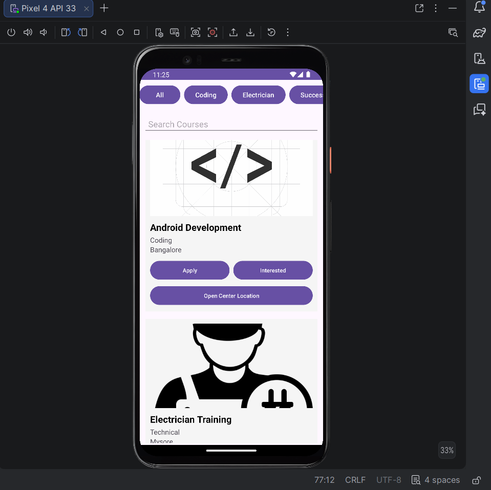
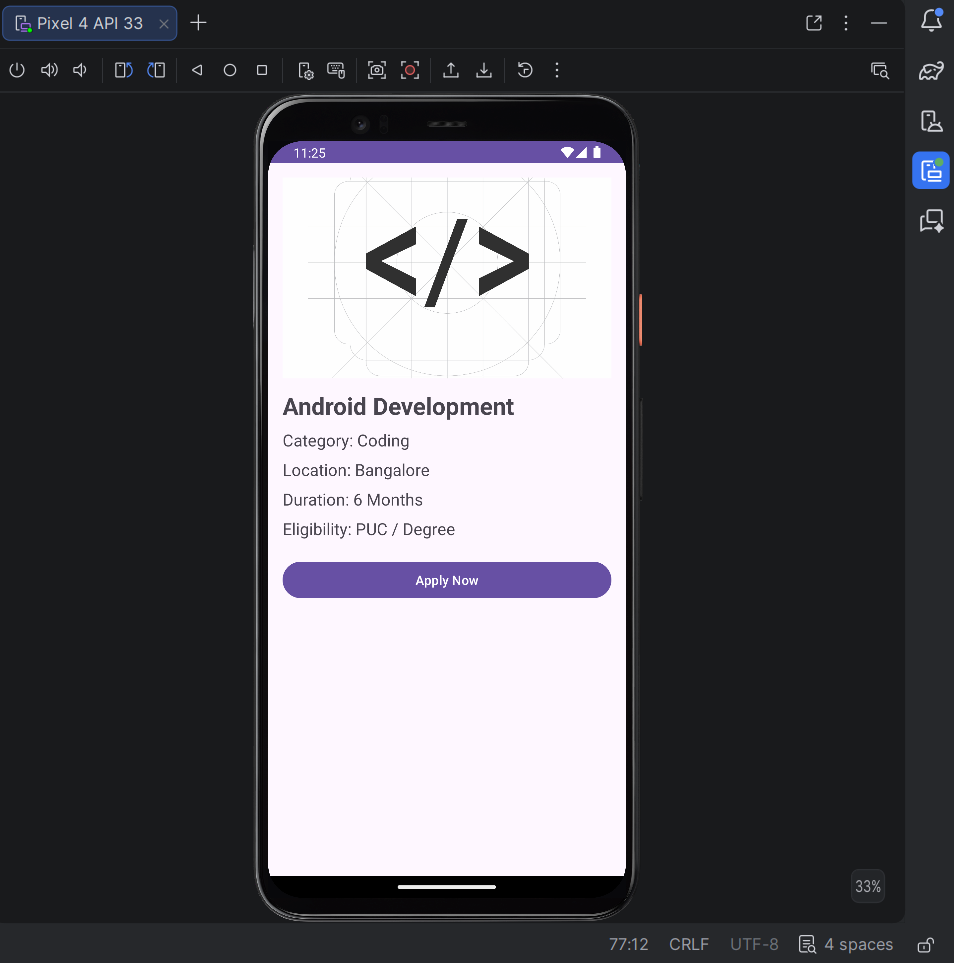
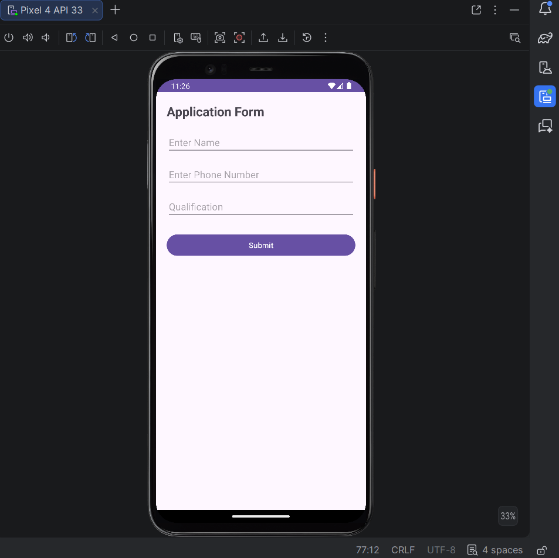
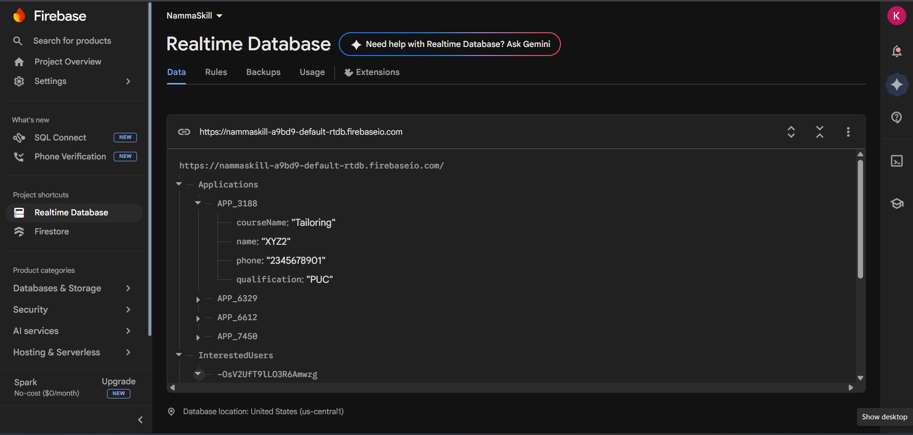

# 🚀 NAMMA-SKILL

## 📱 Project Description
NAMMA-SKILL is an Android application developed using Kotlin and Firebase. It helps users explore and apply for skill development courses easily.

---

## ✨ Features
- Course Listing  
- Search Functionality  
- Course Details  
- Eligibility Validation  
- Application Form  
- Firebase Realtime Database  
- Google Maps Integration  

---

## 🛠 Technologies Used
- Kotlin  
- Android Studio  
- XML  
- Firebase Realtime Database  
- Google Maps API  

---

## 📸 Screenshots

### Splash Screen

### Home Screen

### Course Details

### Application Form

### Firebase Output

---

## ⚙️ Installation
1. Clone the repository  
2. Open in Android Studio  
3. Run the app  

---

## 🎯 Objective
To provide a simple platform for users to explore and apply for skill development courses.

---

## 🔮 Future Work
- User Login  
- Admin Panel  
- Payment Integration  

---

## 👩‍💻 Developed By
Keerthana

Added complete README with screenshots
